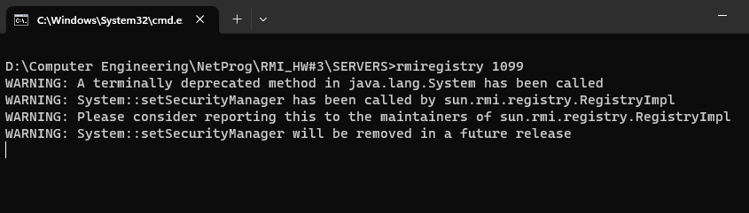
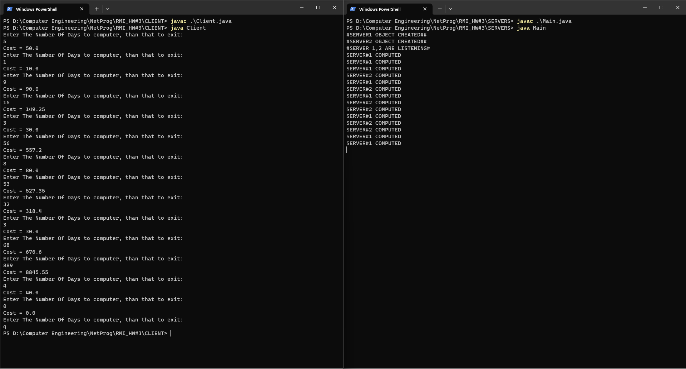
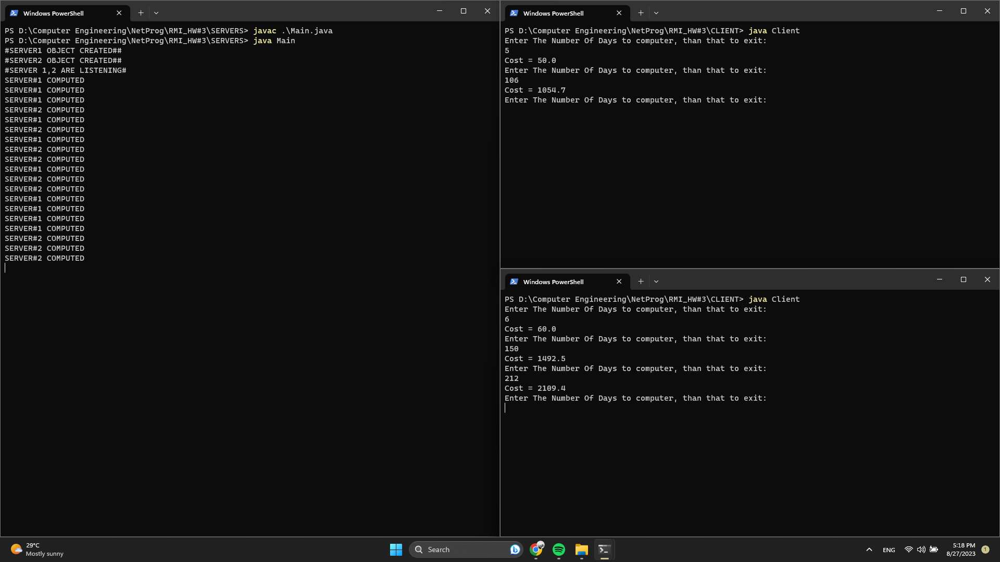

# Remote Method Invocation - Advertisement Cost Calculator

  This is an RMI (Remote Method Invocation) system designed for an advertisement company's cost calculation services. 
  The system consists of one client and two servers, "Server1" and "Server2", each offering different cost computation formulas based on the number of days an advertisement runs. 
    • Server1: Computes the cost of the advertisement using the formula: cost = days * 10. 
    • Server2: Computes the cost of the advertisement using the formula: cost = days * 10 - days * 0.05. 4
  The client's responsibility is to determine which server to call based on the input number of days. 
  => If the number of days is less than or equal to 10, the client calls "Server1". Otherwise, the client calls "Server2" for cost computation.  
Instructions:: 
  Clone the repository to your local machine. 
  run the rmi registry on port 1099. 
  Compile and run the server main class ("Main.java"). 
  Compile and run the client class ("Client.java"). 
  The client will prompt you to enter the number of days for advertisement. 
  The appropriate server will be invoked automatically to calculate the advertisement cost. 
  The calculated cost will be displayed to the client (user). 
 
  Apparatus: RMI Java modules + registry  

